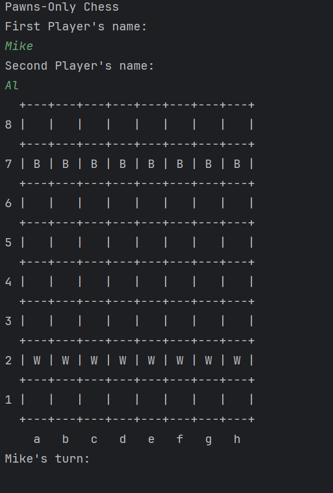

# Overview
Hello traveler!,
Thanks for stopping by and checking this tiny project. The idea behind it comes from the desire of learn and develop
new programming skills. I have found that programming in a new environment with a new language tends to be like 
the blank page dilemma writers face. *What should I program? What is a good project?* Well I have been there, and 
while searching something I could work on I came across with Hyperskill. 

Hyperskill is a web app from JetBrains for the people to learn programming languages. All the content is interactive 
and it takes your hand through the pile of information available to finally offer hands on projects. You can choose 
by difficulty from a list of option which one to make. 

I choose to do the "Pawns-only game". Hyperskill writes: *"Chess is a very popular game, but over time even the 
classic chess rules may become tiresome. The good news is that there are hundreds of variants. 
One of them is Pawns-only chess. Let's make a game where players should move their pawns to the opposite side of the
board or capture all opposite pawns to win. In this project, you will create a game intended for two players."*

I will leave the link below if you are interested.

> ### Current state of the code: STAGE 3 "Game Loop" out of 5.         
> 100% RUNNING CODE THO! :rocket:

# [Software Demo Video](http://youtube.link.goes.here)

# Development Environment

| Tool                  |   Version    |    Build |
|-----------------------|:------------:|---------:|
| IntelliJ IDEA Ultimate | 241.17011.79 | May 2024 |
| Kotlin                |    2.0.0     | May 2024 |
| Open JDK Oracle       |      21      |       -- |

# Useful Websites

- [Hyperskill](https://hyperskill.org/projects/182)
- [Kotlin Docs](https://kotlinlang.org/docs/home.html)
- [TutorialKart](https://www.tutorialkart.com/kotlin/kotlin-if-or/#gsc.tab=0)

# Future Work

- Stage 4 - Moving Forward (It is time for our pawns to move. Introduce basic pawn moves to the program.)
- Stage 5 - Capture and Win (Introduce two new pawns moves — capture and en passant and Implement win and draw conditions to your program.)
